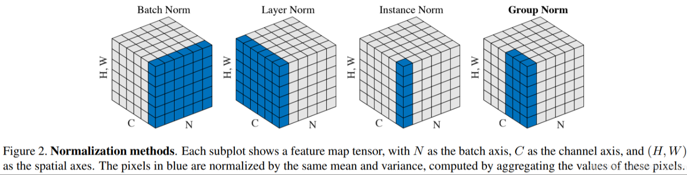
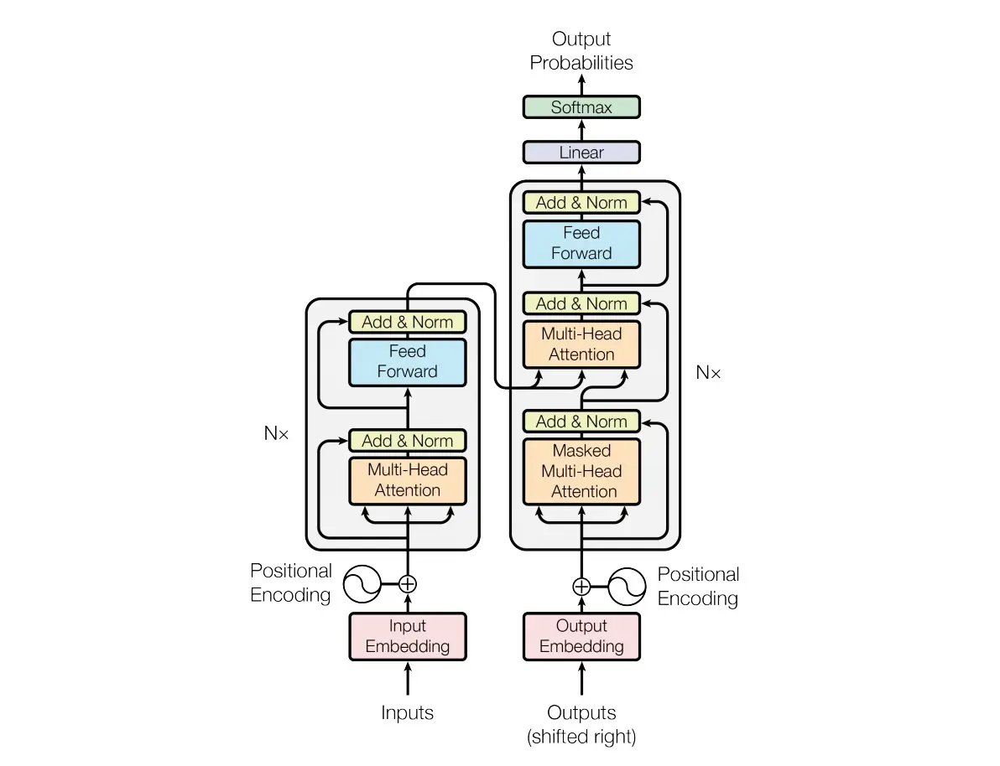
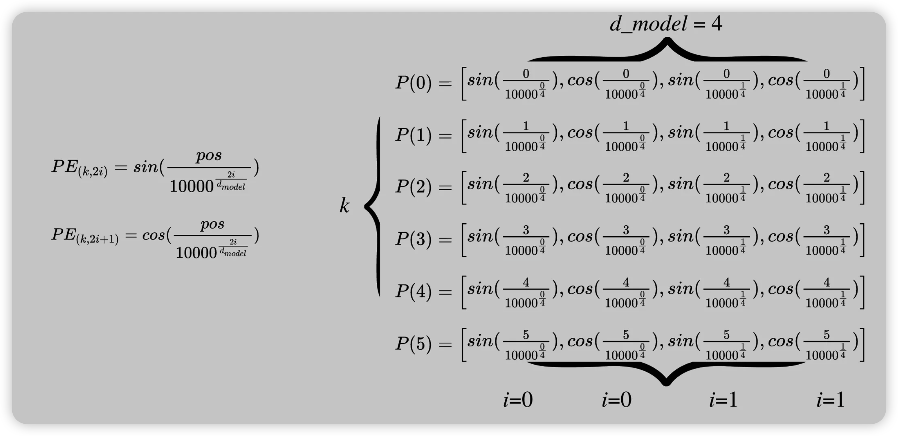

## Serval Basic Units
### Bath Normalize & Layer Normalize
* N 代表批量大小，C 代表序列长度，H、W 代表嵌入尺寸
* 来自操作： BN 对同一批次中的所有数据的同一特征数据进行操作；而 LN 对同一样本进行操作。
* BN 不适合 RNN、变换器等序列网络，也不适合文本长度不确定和批量较小的情况，它适合 CV 中的 CNN 等网络。
* 而 LN 适用于 NLP 中的 RNN 和变换器等网络，因为序列的长度可能不一致。
<!-- *  -->

### Code 
```
     torch.nn.BatchNorm1d(num_features, eps=1e-05, momentum=0.1, affine=True, track_running_stats=True)
     torch.nn.BatchNorm2d(num_features, eps=1e-05, momentum=0.1, affine=True, track_running_stats=True)
     torch.nn.BatchNorm3d(num_features, eps=1e-05, momentum=0.1, affine=True, track_running_stats=True)
     num_features: the number of features from the desired input, the size of the desired input is 'batch_size x num_features [x width]'.
     eps: the value to be added to the denominator to ensure numerical stability (the denominator cannot converge to or take 0). Default is 1e-5.
     momentum: the momentum used for dynamic mean and dynamic variance. The default is 0.1.
     affine: boolean value, when set to true, to add the layer can be learned affine transformation parameters.
     track_running_stats: boolean, when set to true, records the mean and variance during training;
```
### Why Normalization
* 在神经网络中，数据的分布会对训练产生影响。例如，如果一个神经元 x 的值为 1，而 Weights 的初始值为 0.1，那么下一层神经元将计算 Wx = 0.1；或者如果 x = 20，那么 Wx 的值将为 2。我们还没发现问题，但当我们添加一层激励来激活 Wx 的这个值时，问题就出现了。如果我们使用 tanh 这样的激励函数，Wx 的激活值就会变成 ~0.1 和 ~1，而接近 1 的部分已经处于激励函数的饱和阶段，也就是说，如果 x 无论扩大多少，tanh 激励函数的输出仍然接近 1。换句话说，神经网络不再对初始阶段的大范围 x 特征敏感。换句话说，神经网络不再对初始阶段那些大范围的 x 特征敏感。这就糟糕了，想象一下，拍打自己和撞击自己的感觉没有任何区别，这就证明我的感觉系统失灵了。当然，我们可以使用前面提到的归一化预处理，让输入 x 范围不要太大，这样输入值就能通过激励函数的敏感部分。但这种不敏感问题不仅出现在神经网络的输入层，也会出现在隐藏层。但是，当 x 被隐藏层取代后，我们还能像以前那样对隐藏层的输入进行归一化处理吗？答案是肯定的，因为大人物们已经发明了一种叫做批量归一化的技术，可以解决这种情况。
### BN Add Location
* 批量归一化是将一批数据分成若干小批，用于随机梯度下降。此外，在对每批数据进行前向传播时，会对每一层进行归一化处理。
### BN Result
* * 批量归一化也可以看作是一层。在逐层添加神经网络时，我们从数据 X 开始，添加一个全连接层，全连接层的结果通过激励函数成为下一层的输入，然后重复前面的操作。在每个全连接层和激励函数之间添加批量归一化（BN）。正如我之前所说，结果在进入激励函数之前的值很重要，如果我们不只看一个值，我们可以说结果值的分布对激励函数很重要。如果我们不只看一个值，我们就可以说计算值的分布对激发函数很重要，如果数值大多分布在这个区间内，数据的传递效率就会更高。比较一下激活前这两个值的分布。
* 上面的数据没有经过归一化处理，而下面的数据经过了归一化处理，这当然意味着下面的数据能够更有效地利用 tanh 进行非线性化处理。在对未归一化的数据进行 tanh 激活后，大部分激活值都分布到了饱和阶段，即大部分激活值不是-1 就是 1，而在归一化后，大部分激活值仍然存在于分布的每个区间。通过将这种激活分布传递给神经网络的下一层进行后续计算，每个区间中存在的分布对神经网络更有价值。批量归一化不只是对数据进行归一化，它还会对数据进行去归一化。
### Flaws of BN
* BN是按照样本数计算归一化统计量的，当样本数很少时，比如说只有4个。这四个样本的均值和方差便不能反映全局的统计分布息，所以基于少量样本的BN的效果会变得很差。在一些场景中，比如说硬件资源受限，在线学习等场景，BN是非常不适用的。
* 
## Positional Encoding
* 假设您有一个长度为的L输入序列，并且需要$k^{th}$对象在此序列中的位置。位置编码由不同频率的正弦和余弦函数给出：
$$
     P(k,2i) = sin(\frac{k}{n^{\frac{2i}{d_{model}}}})
$$
$$
     P(k,2i+1) = cos(\frac{k}{n^{\frac{2i}{d_{model}}}})
$$
* K: 对象在输入序列中的位置, $0<=k<\frac{L}{2}$
* $d_{model}$: 输出嵌入空间的尺寸
* n 用户定义的标量，由 Attention Is All You Need 的作者设置为 10,000。
* i 用于映射到列索引 $0<=i<\frac{d_{model}}{2}$ 具有正弦和余弦函数的i单个映射值.
* P(k,j) 位置函数，用于将输入序列中的位置 k 映射到位置矩阵的索引 (k,j) 
* 
<!-- https://miro.medium.com/v2/resize:fit:4800/format:webp/1*SMXg-0Yd-x-6g818nUfsUw.png -->
### Reference
* [图解 Transformers](https://zhuanlan.zhihu.com/p/654051912)
* [Dive deepl into Transformer](https://www.linkedin.com/pulse/deep-dive-positional-encodings-transformer-neural-network-ajay-taneja#:~:text=Positional%20Encodings%20can%20be%20looked,vector%20representation%20of%20the%20input.)
* [why trigonometric function PE?](https://machinelearningmastery.com/a-gentle-introduction-to-positional-encoding-in-transformer-models-part-1/)